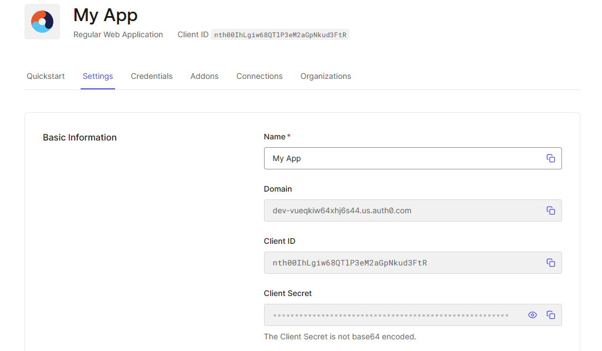
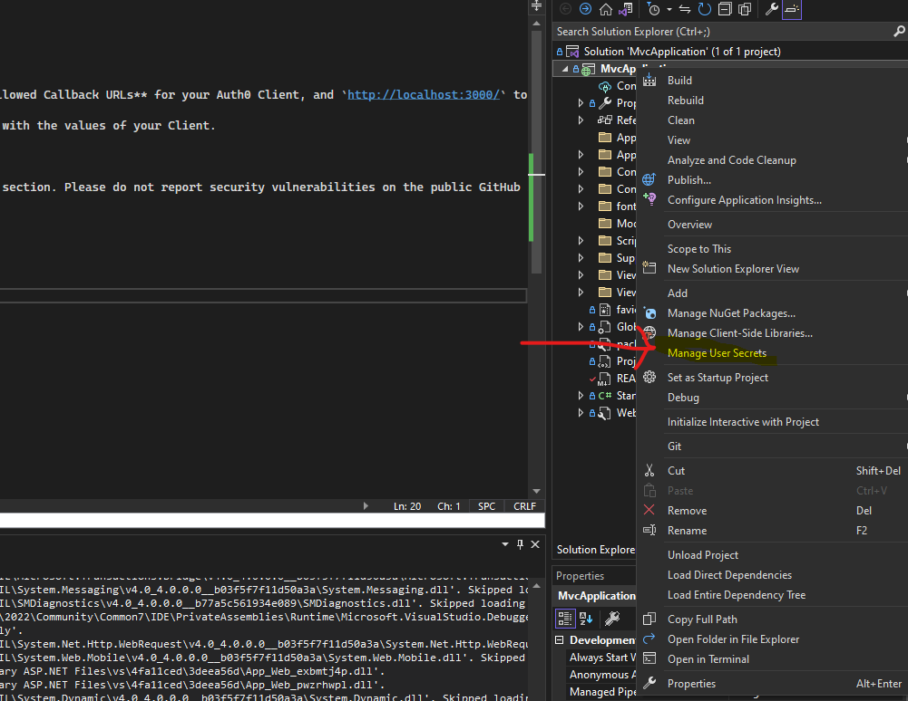

# Auth0 - ASP.NET (OWIN) MVC sample

[Full tutorial](https://auth0.com/docs/quickstart/webapp/aspnet-owin/02-user-profile)

## Running the example

In order to run this project, you will need to add `http://localhost:3000/callback` to the list of **Allowed Callback URLs** for your Auth0 Client, and `http://localhost:3000/` to the list of **Allowed Logout URLs**.

Also update the `auth0:ClientId`, `auth0:ClientSecret` and `auth0:Domain` settings in the `web.config` with the values of your Client.

## Issue Reporting

If you have found a bug or if you have a feature request, please report them at this repository issues section. Please do not report security vulnerabilities on the public GitHub issue tracker. The [Responsible Disclosure Program](https://auth0.com/whitehat) details the procedure for disclosing security issues.

## Author

[Auth0](https://auth0.com)

## Secrets.xml





``` xml
<?xml version="1.0" encoding="utf-8"?>
<root>
    <secrets ver="1.0">
        <secret name="auth0:Domain" value="###" />
        <secret name="auth0:ClientId" value="###" />
        <secret name="auth0:ClientSecret" value="###" />
    </secrets>
</root>
```

[ConfigBuilders](https://learn.microsoft.com/en-us/aspnet/config-builder)